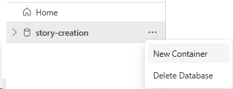
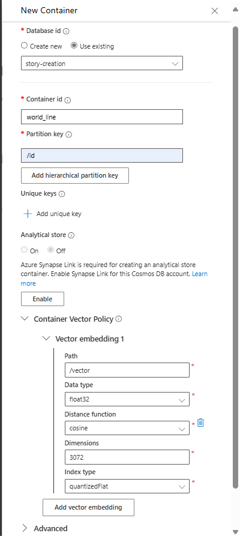
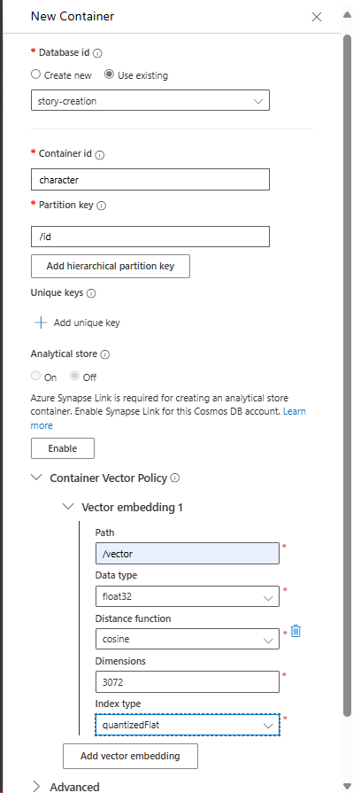

# リソース作成

## Bicepからリソース作成

1. リソースグループの作成
  - 以下Bicepファイルでリソースグループを作成。
    - ./create-rg/main.bicep
2. リソースの作成
  - 以下Bicepファイルでリソースを作成。
    - ./main.bicep
  - Bicepファイルには以下リソースが含まれる。
    - CosmosDBアカウント
      - CosmosDBデータベース

## Portalから設定

### CosmosDBコンテナ

#### world_lineコンテナ作成

#### characterコンテナ作成

